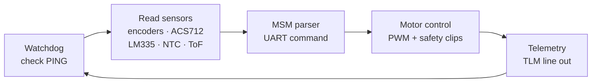

<!-- Version: v2.2 (English) -->
# Rover Low-Level Controller (LLC) — Rust / AVR

[](./LICENSE)
[](#)
[](./rust-toolchain.toml)
[](https://www.microchip.com/en-us/product/atmega2560)
[](https://github.com/Alonso11/rover-low-level-controller/actions/workflows/rust.yml)

> **TL;DR** — Modular firmware for a 6-wheel rover on the **ATmega2560** (Arduino
> Mega 2560), written in embedded Rust (`no_std`). Acts as the Low-Level Controller
> (LLC): it receives **MSM-protocol** commands from the Raspberry Pi 5 (HLC, Yocto
> Linux) over UART and drives motors, encoders, proximity and current sensors on a
> hard-real-time 20 ms loop. A software fault on the HLC can never reach the motors.

---

## Table of Contents

- [Overview](#overview)
- [Safety Architecture](#safety-architecture)
- [System Architecture](#system-architecture)
- [Project Structure](#project-structure)
- [Prerequisites](#prerequisites)
- [Build & Flash with the Makefile](#build--flash-with-the-makefile)
  - [Main Targets](#main-targets)
  - [Feature Flags](#feature-flags)
- [Testing](#testing)
  - [Logic Tests (x86, no hardware)](#logic-tests-x86-no-hardware)
  - [Hardware Tests (PC + Arduino over USB)](#hardware-tests-pc--arduino-over-usb)
- [Examples](#examples)
  - [Main Firmware](#main-firmware)
  - [Subsystem Tests](#subsystem-tests)
  - [Hardware Debug / Bisection](#hardware-debug--bisection)
  - [Utilities](#utilities)
- [MSM Protocol](#msm-protocol)
- [Documentation](#documentation)
- [Hardware References](#hardware-references)
- [License](#license)
- [Author](#author)

---

## Overview

Modular firmware for a 6-wheel rover in **embedded Rust** running on the
**ATmega2560** (Arduino Mega 2560). It acts as the Low-Level Controller (LLC):
it receives **MSM-protocol** commands from the **Raspberry Pi 5** (Yocto Linux)
over UART and manages motors, encoders, proximity and current sensors.

The main build/flash/test interface is the **Makefile** — see
[Build & Flash with the Makefile](#build--flash-with-the-makefile).

---

## Safety Architecture

The LLC is the safety authority for the whole rover. It runs a 20 ms hard-real-time
control loop and can autonomously bring the rover to a **safe stop** if any of the
following occurs:

- **Watchdog expiry** — no `PING` from the HLC for ~2 s ⇒ `FAULT`.
- **Over-current** — any ACS712 channel exceeds its Warn / Limit / Fault threshold.
- **Stall detection** — encoder-derived stall flag per motor channel.
- **Out-of-range setpoint** — HLC command clipped before reaching the drivers.
- **Emergency proximity** — HC-SR04 on D38/D39 reports an obstacle below the
  safety distance.

Because motor control lives entirely on the LLC, **a software fault on the
HLC (Linux/Yocto) can never compromise physical safety** — the LLC keeps full
authority over the BTS7960/L298N drivers.

---

## System Architecture

```
┌──────────────────────────────┐        ┌────────────────────────────────────┐
│  Raspberry Pi 5 (HLC)        │        │  Arduino Mega 2560 (LLC)           │
│  olympus_controller.py        │        │  rover-low-level-controller        │
│  rover_bridge.so (Rust/PyO3) │        │                                    │
│                              │─ USB ──│─ USART0 (development)               │
│                              │─ GPIO ─│─ USART3 D14/D15 (production)        │
└──────────────────────────────┘        │                                    │
                                        │  6× motors L298N  (PWM Timer2/3/4)│
                                        │  6× Hall encoders (INT0–INT5) +    │
                                        │  MPU-6050 (Accel/Gyro) soft I2C    │
                                        │  HC-SR04 D38/D39 (emergency)       │
                                        │  VL53L0X D42/D43 soft I2C (tactical)│
                                        │  6× ACS712-30A A0–A5 (current)     │
                                        │  LM335 A6 (ambient temperature)    │
                                        │  6× NTC A7–A12 (cell temperature)  │
                                        └────────────────────────────────────┘
```

The LLC's main loop is deterministic and runs in fixed order every cycle:



---

## Project Structure

```
src/
├── lib.rs                     # Library entry point
├── main.rs                    # Main loop: watchdog → sensors → MSM → motors → TLM
├── config.rs                  # Compile-time constants (times, thresholds, ADC periods)
├── motor_control/
│   ├── mod.rs                 # Motor / Servo traits + SixWheelRover (pure logic)
│   ├── l298n.rs               # L298N driver (AVR)
│   ├── bts7960.rs             # BTS7960 high-power driver (AVR)
│   ├── servo.rs               # Software-PWM servo (AVR)
│   └── erased.rs              # ErasedMotor — type erasure for motor arrays
├── sensors/
│   ├── mod.rs                 # ProximitySensor trait + SensorError enum
│   ├── encoder.rs             # HallEncoder (interrupt-safe with AtomicI32) (AVR)
│   ├── hc_sr04.rs             # HC-SR04 ultrasonic D38/D39, Result API (AVR)
│   ├── vl53l0x.rs             # VL53L0X ToF I2C D42/D43 soft I2C, Result API (AVR)
│   ├── soft_i2c.rs            # Bit-bang I2C with clock-stretch timeout (AVR)
│   ├── acs712.rs              # ACS712-30A motor current (pure Rust)
│   ├── lm335.rs               # LM335 ambient temperature (pure Rust)
│   ├── ntc_thermistor.rs      # NTC AD36958 cell temperature (pure Rust)
│   └── tf_luna.rs             # TF-Luna LiDAR reserved, Result API (AVR)
├── controller/
│   └── mod.rs                 # RoverController — per-channel stall detection
├── state_machine/
│   └── mod.rs                 # MSM — 5 states, watchdog, format_response
└── command_interface/
    └── mod.rs                 # MSM protocol buffer (UART)

examples/                      # Programs to flash to the Arduino (AVR)
tests/
├── state_machine_test / ekf_test.rs   # Pure-logic MSM tests (x86, no hardware)
├── motor_logic_test.rs        # Motor logic tests (x86, no hardware)
├── sensors_test.rs            # ACS712 / LM335 driver tests (x86, no hardware)
└── hardware/
    ├── test_msm_protocol.py   # MSM-protocol verification from PC over USB
    └── test_motors_debug.py   # Individual motor debug from PC over USB
docs/                          # Hardware diagrams, design notes
```

---

## Prerequisites

```bash
# AVR toolchain (Debian / Ubuntu)
sudo apt-get install gcc-avr avr-libc

# Rust nightly toolchain + rust-src
rustup toolchain install nightly
rustup component add rust-src --toolchain nightly

# Python environment (tests, scripts)
make setup
```

> The project pins `nightly` via [`rust-toolchain.toml`](./rust-toolchain.toml)
> with the `rust-src` component, so any `cargo +nightly` invocation in this repo
> automatically uses the right toolchain.

---

## Build & Flash with the Makefile

The **Makefile** is the primary interface. It compiles and flashes automatically
with **Ravedude** (the AVR USB flasher). You only need to set `PORT`:

```bash
# Flash the main firmware (ACS712-30A, default)
make flash PORT=/dev/ttyUSB0

# Flash with configuration variants (feature flags)
make flash-allbts              PORT=/dev/ttyUSB0   # 6× BTS7960 (operational)
make flash-mixed               PORT=/dev/ttyUSB0   # FR/FL=L298N, rest=BTS7960
make flash-20a                 PORT=/dev/ttyUSB0   # 6× ACS712-20A
make flash-allbts-rl-l298n     PORT=/dev/ttyUSB0   # 5× BTS + RL as L298N

# Flash debug examples
make flash-debug-all   PORT=/dev/ttyUSB0   # 6 motors, 3 s forward
make flash-debug-only-fr PORT=/dev/ttyUSB0 # only FR (bisection)
```

### Main Targets

| Target | Description |
|--------|-------------|
| `make flash` | Main firmware — ACS712-30A (default) |
| `make flash-allbts` | 6× BTS7960 + NTC4 + no MPU / VL53L0X / LM335 (operational) |
| `make flash-allbts-rl-l298n` | 5× BTS7960 + RL as L298N |
| `make flash-mixed` | FR/FL=L298N, CR/CL/RR/RL=BTS7960 |
| `make flash-20a` | 6× ACS712-20A |
| `make flash-allbts-bringup` | BTS7960 without stall / OC / HC-SR04 (bring-up) |
| `make flash-allbts-rampfix` | BTS7960 + ramp-converge + idle-disable (fixes FR stuck in FAULT) |
| `make flash-no-oc` | Over-current protection disabled (HW tests) |
| `make flash-motors-only` | Motors only (no OC / stall / LM335 / HC-SR04) |
| `make test-unit` | x86 tests: Rust (3 suites) + pytest unit |
| `make monitor` | `screen` serial at 115200 (Ctrl+A → k to quit) |
| `make setup` | `uv sync` — install Python deps |
| `make clean` | `cargo clean` + remove `.venv` and `__pycache__` |

### Feature Flags

Activated via Cargo `--features`. The Makefile composes them for each target:

| Flag | Effect |
|------|--------|
| `all-bts7960` | 6 motors with BTS7960 driver (high power) |
| `mixed-drivers` | FR/FL=L298N, CR/CL/RR/RL=BTS7960 |
| `all-20a` | 6× ACS712-20A (vs 30 A default) |
| `rl-l298n` | RL as L298N (combined with `all-bts7960`) |
| `no-oc` | Disable over-current protection |
| `no-stall` | Disable encoder-based stall detection |
| `no-lm335` | Disable LM335 (ambient temperature) |
| `no-hcsr04` | Disable HC-SR04 entirely |
| `hcsr04-no-fault` | HC-SR04 read but does not trigger a proximity FAULT |
| `no-tof` | Disable VL53L0X |
| `no-mpu` | Disable MPU-6050 + EKF |
| `no-ntc` | Disable NTC battery-temperature reading |
| `ntc4` | Only 4 NTCs connected (A7–A10) |
| `ramp-converge` | Force ramp to 0 in states without traction |
| `no-watchdog` | Disable the comms watchdog |
| `idle-disable` | De-energise drivers in Fault / Safe / Standby |

**Direct usage without the Makefile:**
```bash
RAVEDUDE_PORT=/dev/ttyUSB0 RUSTFLAGS="-C target-cpu=atmega2560" \
  cargo +nightly run --release -Zjson-target-spec -Zbuild-std=core \
  --features all-bts7960,ntc4,no-tof,no-mpu,no-lm335
```

**Compile only (no flash):**
```bash
RUSTFLAGS="-C target-cpu=atmega2560" cargo +nightly build --release \
  -Zjson-target-spec -Zbuild-std=core
```

---

## Testing

### Logic Tests (x86, no hardware)

Validate the MSM, analog drivers and motor logic on the developer machine:

```bash
make test-unit
# or directly:
./test_native.sh
```

| Suite | Tests | Coverage |
|-------|-------|----------|
| `state_machine_test` / `ekf_test` | 46 | All MSM transitions, watchdog, `format_response`, TLM parser (including odometry fields) |
| `sensors_test` | 64 | ACS712 mA conversion, LM335 °C conversion, NTC LUT interpolation, Warn/Limit/Fault thresholds |
| `motor_logic_test` | 28 | Speed mapping, L298N/BTS7960 direction signs, SixWheelRover, ErasedMotor |

### Hardware Tests (PC + Arduino over USB)

Require the Arduino connected and the firmware flashed. Run via `make`:

```bash
# I²C scan (verify 0x29 / 0x40 / 0x68)
make i2c-scan PORT=/dev/ttyUSB0

# Individual sensors (INT-04b)
make test-sensors PORT=/dev/ttyUSB0

# MSM protocol — 13 tests (INT-05)
make test-protocol PORT=/dev/ttyUSB0

# Interactive motors (INT-07, requires debug_motors_l298n flashed)
make test-motors PORT=/dev/ttyUSB0

# Motors with main firmware (INT-07 in EXP mode)
make test-motors-main PORT=/dev/ttyUSB0

# Odometry + sensor calibration (INT-08)
make calibrate PORT=/dev/ttyUSB0

# Full INT-04b + INT-05 suite, sequential
make int-all PORT=/dev/ttyUSB0
```

| Script | Required firmware | Description |
|--------|-------------------|-------------|
| `tests/hardware/test_msm_protocol.py` | Main firmware (v2.10+) | 13 automated MSM-protocol tests + TLM format validation |
| `tests/hardware/test_motors_debug.py` | `examples/debug_motors_l298n` | Interactive F/B/S control to verify each motor individually |
| `tests/hardware/test_sensors_individual.py` | Main firmware | Verifies 8 sensors within the TLM range |
| `tests/hardware/test_tf02.py` | Main firmware | Verifies TF02 LiDAR over UART |
| `tests/hardware/i2c_scan.py` | Main firmware | Scans I²C addresses |
| `tests/hardware/calibrate_odometry.py` | Main firmware | Odometry calibration |

See [`docs/testing.md`](docs/testing.md) for the full explanation of flags,
troubleshooting and the recommended pre-commit workflow.

---

## Examples

Complete programs to flash to the Arduino. Each is an independent AVR binary.
Flash with `make flash-<name>` or manually:

```bash
RAVEDUDE_PORT=/dev/ttyUSB0 RUSTFLAGS="-C target-cpu=atmega2560" \
  cargo +nightly run --example <name> --release -Zjson-target-spec -Zbuild-std=core
```

### Main Firmware

| Example | `make` target | Description |
|---------|---------------|-------------|
| `control_motor_usb_l298n` | — | Serial control over USB + L298N (development with PC) |
| `control_motor_rpi` | — | GPIO UART USART3 control + L298N (RPi production) |
| `control_6_motors_l298n` | — | 6-wheel differential drive, command interface |

### Subsystem Tests

| Example | `make` target | Description |
|---------|---------------|-------------|
| `test_controller` | — | RoverController with ErasedMotor and stall detection |
| `test_encoders` | — | Hall-encoder reading (INT0–INT5) + MPU-6050 |
| `test_proximity` | — | HC-SR04 + VL53L0X — distance measurement |
| `test_l298n` | — | Single L298N motor test |
| `test_bts7960` | — | BTS7960 high-power motor test |
| `test_servo` | — | Servo sweep 0–180° (Timer1) |
| `test_rpi_communication` | — | USART3 echo — verifies RPi GPIO wiring |
| `test_msm_protocol` | — | MSM-protocol validator over USB |
| `test_acs712_current` | — | ACS712 current reading on A0 |
| `test_lm335_temperature` | — | LM335 temperature reading on A6 |
| `test_serial_echo` | — | Serial echo over USB |
| `test_hcsr04_filtered` | — | HC-SR04 with measurement filtering |
| `test_ina3221_dual_cell` | — | INA3221 dual-cell battery monitor |
| `test_6_motors_all_bts` | `flash-test-6motors` | 6 BTS7960 motors fwd 40 % 3 s |
| `test_motors_encoders_acs` | `flash-test-motors-enc-acs` | Motors + encoders + ACS712 (CSV) |
| `test_motors_encoders_acs_rl_l298n` | `flash-test-motors-enc-acs-rl-l298n` | 5×BTS + RL=L298N + encoders + ACS |
| `test_only_rl_l298n` | `flash-test-only-rl` | Only RL via L298N |
| `test_integration_full` | `flash-test-integration-full` | Full integration (all sensors) |
| `test_integration_no_ina` | `flash-test-integration-no-ina` | Integration without INA3221 |

### Hardware Debug / Bisection

| Example | `make` target | Description |
|---------|---------------|-------------|
| `debug_motors_l298n` | — | Pinout debug — activates one motor at a time |
| `debug_motors_sequential` | `flash-debug-motors-seq` | One motor at a time, MSM pinout |
| `debug_all_motors` | `flash-debug-all` | 6 motors forward 3 s |
| `debug_all_motors_bts` | `flash-debug-all-bts` | 6× BTS7960 forward 3 s |
| `debug_front_center` | `flash-debug-front-center` | FR+FL+CR+CL forward 3 s (no RR/RL) |
| `debug_only_fr` | `flash-debug-only-fr` | Only FR (maximum isolation) |
| `debug_only_fl` | `flash-debug-only-fl` | Only FL, HOLD 15 s |
| `debug_only_cr` | `flash-debug-only-cr` | Only CR |
| `debug_only_cl` | `flash-debug-only-cl` | Only CL |
| `debug_only_rr` | `flash-debug-only-rr` | Only RR |
| `debug_only_rl` | `flash-debug-only-rl` | Only RL (L298N) |
| `debug_only_rl_bts` | `flash-debug-only-rl-bts` | Only RL (BTS7960) |
| `debug_only_fr_fl` | `flash-debug-only-fr-fl` | FR+FL forward 3 s |
| `debug_only_cr_cl` | `flash-debug-only-cr-cl` | CR+CL forward 3 s |
| `debug_only_rr_rl` | `flash-debug-only-rr-rl` | RR(BTS) + RL(L298N) |
| `debug_only_rr_rl_bts` | `flash-debug-only-rr-rl-bts` | RR + RL both BTS |
| `debug_only_fr_enc` | `flash-debug-fr-enc` | FR vs FL encoder ratio |
| `debug_only_fl_enc` | `flash-debug-only-fl-enc` | FL motor + encoder (CSV) |
| `debug_encoders_drive` | `flash-debug-encoders-drive` | 6 motors + 6 encoders (CSV) |
| `debug_encoders_acs` | `flash-debug-encoders-acs` | 6 BTS + 6 encoders + 6 ACS |
| `debug_rr_acs` | `flash-debug-rr-acs` | RR motor + ACS712 A4 |
| `debug_fl_allint` | `flash-debug-fl-allint` | FL only, 6 INTs enabled |
| `debug_fl_bisect` | `flash-debug-fl-bisect` | FL continuous, unmask INTs |
| `debug_hcsr04_raw` | — | Raw HC-SR04 readings |
| `debug_hcsr04_d38` | `flash-debug-hcsr04-d38` | HC-SR04 D38/D39 full range |

### Utilities

| Example | `make` target | Description |
|---------|---------------|-------------|
| `validate_protocol` | — | Protocol validator (PC serial terminal) |
| `ina3221_battery_logger` | `flash-ina-logger` | Discharge-curve logger V, 3 banks |
| `medir_bateria` | `flash-medir-bateria` | Battery measurement (2nd Mega, A0 divider) |
| `medir_bateria_raw` | `flash-medir-bateria-raw` | Raw ADC, scaling factor in Python |

---

## MSM Protocol

ASCII communication with `\n` terminator at 115200 baud, 8N1.

### Commands — RPi5 → Arduino

| Command | Action |
|---------|--------|
| `PING` | Keepalive — resets the watchdog (~2 s without `PING` ⇒ `FAULT`) |
| `STB` | Standby (motors stopped) |
| `EXP:<l>:<r>` | Explore with velocities 0–100 (e.g. `EXP:80:80`) |
| `AVD:L` / `AVD:R` | Avoid left / right |
| `RET` | Reverse |
| `FLT` | Force FAULT from the HLC |
| `RST` | Reset → Standby |

### Responses — Arduino → RPi5

| Response | Meaning |
|-----------|---------|
| `PONG` | Reply to `PING` |
| `ACK:<STATE>` | Transition confirmed (e.g. `ACK:EXP`) |
| `ERR:ESTOP` | Command rejected (Arduino in `FAULT`) |
| `ERR:WDOG` | Watchdog expired → `FAULT` |
| `ERR:UNKNOWN` | Unrecognised command |

### Asynchronous telemetry (every ~1 s)

```
TLM:<SAFETY>:<STALL>:<TS>ms:<MV>mV:<MA>mA:<I0>:<I1>:<I2>:<I3>:<I4>:<I5>:<T>C:<B0>:<B1>:<B2>:<B3>:<B4>:<B5>C:<DIST>mm:<EL>:<ER>
```

| Field | Description |
|-------|-------------|
| `SAFETY` | `NORMAL` / `WARN` / `LIMIT` / `FAULT` |
| `STALL` | 6 bits `0`/`1`: bit5=FR … bit0=RL |
| `TS` | ms since boot (u32, monotonic) |
| `MV` / `MA` | battery voltage and current (INA226) |
| `I0`–`I5` | per-motor current in mA (ACS712, FR→RL) |
| `T` | ambient temperature in °C (LM335) |
| `B0`–`B5` | battery-cell temperature in °C (NTC) |
| `DIST` | front distance in mm (VL53L0X ToF) |
| `EL` | left encoder accumulator: FL+CL+RL (odometry) |
| `ER` | right encoder accumulator: FR+CR+RR (odometry) |

Example:
```
TLM:NORMAL:000000:1000ms:14800mV:1200mA:1150:980:1100:1050:1200:1180:27C:28:29:28:30:29:28C:342mm:60:62
```

---

## Documentation

| Doc | Contents |
|-----|----------|
| [`docs/the_pins_connections.md`](docs/the_pins_connections.md) | Complete ATmega2560 pin map |
| [`docs/rpi5_uart_communication.md`](docs/rpi5_uart_communication.md) | RPi5 ↔ Arduino communication, MSM protocol, wiring |
| [`docs/consideration_implementation.md`](docs/consideration_implementation.md) | Design decisions: ErasedMotor, timers, TLM, sensors, config.rs |
| [`docs/motors.md`](docs/motors.md) | Motor architecture, PWM, encoders |
| [`docs/vl53l0x.md`](docs/vl53l0x.md) | VL53L0X ToF sensor (tactical, D42/D43 soft I²C) |
| [`docs/hc_sr04.md`](docs/hc_sr04.md) | HC-SR04 sensor (emergency, D38/D39), Result API |
| [`docs/acs712.md`](docs/acs712.md) | ACS712-30A current sensor, graduated protection |
| [`docs/lm335.md`](docs/lm335.md) | LM335 temperature sensor |
| [`docs/encoder.md`](docs/encoder.md) | Hall encoders, ISRs, stall detection |
| [`docs/peripheral_timers.md`](docs/peripheral_timers.md) | PWM timer allocation |
| [`docs/decision-log.md`](docs/decision-log.md) | Architecture decision history |
| [`docs/testing.md`](docs/testing.md) | Testing guide: flags, 131 x86 tests, workflow, troubleshooting |

---

## Hardware References

- **ATmega2560 Datasheet** — [Microchip](https://www.microchip.com/en-us/product/atmega2560)
- **Arduino Mega 2560 Pin Mapping** — [Arduino docs](https://docs.arduino.cc/hacking/hardware/PinMapping2560)
- **HC-SR04 Datasheet** — [SparkFun](https://cdn.sparkfun.com/datasheets/Sensors/Proximity/HCSR04.pdf)
- **VL53L0X Datasheet** — [ST Microelectronics](https://www.st.com/en/imaging-and-photonics-solutions/vl53l0x.html)
- **ACS712 Datasheet** — [Allegro MicroSystems](https://www.allegromicro.com/en/products/sense/current-sensor-ics/zero-to-fifty-amp-integrated-conductor-sensor-ics/acs712)

---

## License

Distributed under the MIT License. See the `LICENSE` file for details.

---

## Author

**Fabián Alonso Gómez Quesada**
Instituto Tecnológico de Costa Rica (TEC)
School of Electronics Engineering
SETEC Lab — Space Systems Laboratory

---

<!-- REPO-MAINTAINER NOTE
  Recommended one-time settings to improve discoverability:

  gh repo edit Alonso11/rover-low-level-controller \
      --add-topic "embedded-rust" --add-topic "no-std" \
      --add-topic "avr" --add-topic "atmega2560" \
      --add-topic "arduino-mega" --add-topic "rover" \
      --add-topic "firmware" --add-topic "real-time" \
      --add-topic "motor-control" --add-topic "bts7960" \
      --add-topic "l298n" --add-topic "encoder" --add-topic "acs712"

  CI fix applied alongside this README: examples/test_proximity.rs was matching
  Result<u16, SensorError> with Option-style Some/None arms. Changed to Ok/Err.
-->